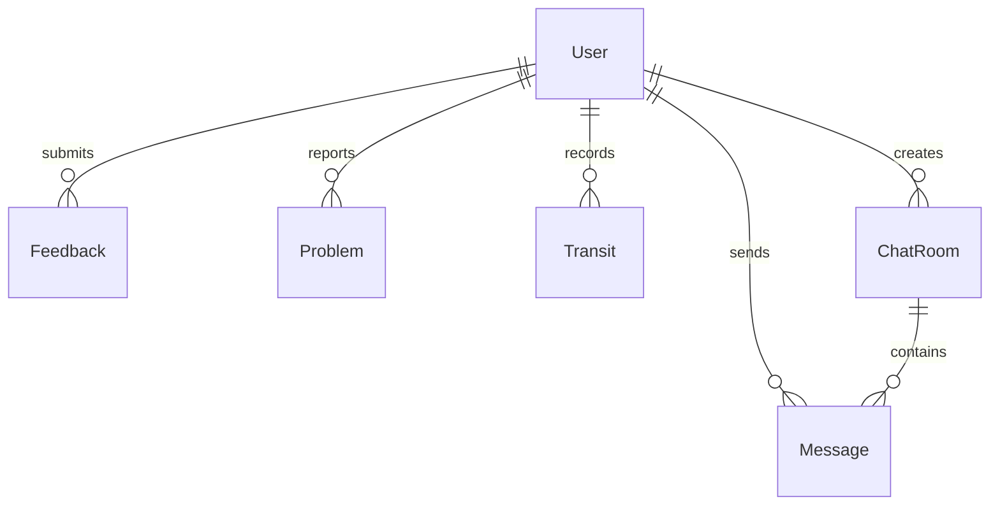

# 🗄️ Hostel Management System - Database Schema

> Complete MongoDB schema documentation for the Hostel Management System

## 📋 Overview

This document provides a comprehensive overview of all database models, collections, and their respective fields based on the Mongoose schema implementation.

---

## 📢 Announcement

```javascript
Collection: Announcement;
```

```javascript
{
  title: String,           // required
  message: String,         // required
  createdAt: Date,        // auto-generated
  updatedAt: Date         // auto-generated
}
```

---

## 💬 Message

```javascript
Collection: Message;
```

```javascript
{
  userId: ObjectId,        // ref: 'User', required
  userName: String,        // required
  message: String,         // default: ''
  imageData: String,       // default: null
  timestamp: Date          // default: Date.now
}
```

---

## 🏠 ChatRoom

```javascript
Collection: ChatRoom;
```

```javascript
{
  roomName: String,                    // required
  roomType: String,                    // required
  description: String,                  // default: ''
  accessLevel: String,                 // required
  restrictedToHostel: String,          // default: null
  roomIcon: String,                    // default: 'fas fa-comments'
  createdBy: ObjectId,                 // ref: 'User'
  messages: [ObjectId],                // ref: 'Message'
  deleted: Boolean,                     // default: false
  deletedAt: Date,                     // default: null
  deletedBy: ObjectId,                  // ref: 'User', default: null
  createdAt: Date,                      // auto-generated
  updatedAt: Date                      // auto-generated
}

// Indexes
deleted: { type: Boolean, index: true }
```

---

## ⭐ Feedback

```javascript
Collection: Feedback;
```

```javascript
{
  rating: String,          // enum: ['1','2','3','4','5'], required
  comment: String,         // default: 'No comment provided'
  day: String,             // enum: ['Sunday','Monday','Tuesday','Wednesday','Thursday','Friday','Saturday'], required
  mealType: String,        // enum: ['Breakfast','Lunch','Snacks','Dinner'], required
  user: ObjectId,          // ref: 'User'
  createdAt: Date,         // default: Date.now
  updatedAt: Date         // auto-generated
}
```

---

## 🍽️ MenuItem (Mess Menu)

```javascript
Collection: MenuItem;
```

```javascript
{
  day: String,             // required
  mealType: String,        // required
  name: String,            // required
  alternateWeek: Boolean,  // default: false
  seasonal: Boolean        // default: false
}
```

---

## 🔐 OTP

```javascript
Collection: OTP;
```

```javascript
{
  email: String,           // required, unique
  otp: String,            // required
  createdAt: Date         // default: Date.now, expires: 600 seconds
}
```

---

## 🔧 Problem (Grievances/Maintenance)

```javascript
Collection: Problem;
```

```javascript
{
  problemTitle: String,                    // required
  problemDescription: String,              // required
  problemImage: String,                    // required
  hostel: String,                          // required
  roomNo: String,                          // required
  category: String,                        // enum: ['Electrical','Plumbing','Painting','Carpentry','Cleaning','Internet','Furniture','Pest Control','Other'], required
  studentId: String,                       // required
  status: String,                          // enum: ['Pending','Resolved','Rejected','ToBeConfirmed'], default: 'Pending'
  studentStatus: String,                   // enum: ['NotResolved','Resolved','Rejected'], default: 'NotResolved'
  timeResolved: Date,                      // default: null
  timeCreated: Date,                       // default: Date.now
  createdAt: Date,                        // auto-generated
  updatedAt: Date                         // auto-generated
}
```

---

## 🚪 Transit (Entry/Exit Records)

```javascript
Collection: Transit;
```

```javascript
{
  studentRollNumber: String,    // required
  studentName: String,          // required, default: 'Unknown'
  studentHostel: String,        // required, default: 'Unknown'
  studentRoomNumber: String,    // required, default: 'Unknown'
  purpose: String,              // required
  transitStatus: String,        // enum: ['ENTRY','EXIT'], required
  date: Date,                   // required, default: current date in YYYY-MM-DD
  time: String,                 // required, default: current time in HH:MM:SS
  createdAt: Date,              // auto-generated
  updatedAt: Date             // auto-generated
}
```

---

## 👤 User

```javascript
Collection: User;
```

```javascript
{
  role: String,                    // enum: ['student','admin','warden'], required, default: 'student'
  name: String,                    // required
  rollNo: String,                  // unique, sparse
  email: String,                   // required, unique
  year: String,                    // enum: ['UG-1','UG-2','UG-3','UG-4']
  hostel: String,                  // enum: ['BH-1','BH-2','BH-3','BH-4']
  roomNo: String,
  password: String,                // required
  feeStatus: {
    hostelFees: Boolean,           // default: false
    messFees: Boolean             // default: false
  },
  createdAt: Date,                 // auto-generated
  updatedAt: Date                 // auto-generated
}
```

---

## 🔗 Relationships



---

## 📊 Collection Summary

| Collection     | Purpose              | Key Features                    |
| -------------- | -------------------- | ------------------------------- |
| `User`         | User management      | Role-based access, fee tracking |
| `Announcement` | System announcements | Time-stamped messages           |
| `ChatRoom`     | Communication        | Multi-level access, soft delete |
| `Message`      | Chat messages        | Image support, user tracking    |
| `Feedback`     | Mess feedback        | Rating system, meal tracking    |
| `MenuItem`     | Mess menu            | Weekly/seasonal items           |
| `Problem`      | Maintenance requests | Status tracking, categorization |
| `Transit`      | Entry/exit logs      | Time tracking, purpose logging  |
| `OTP`          | Authentication       | Auto-expiring tokens            |
